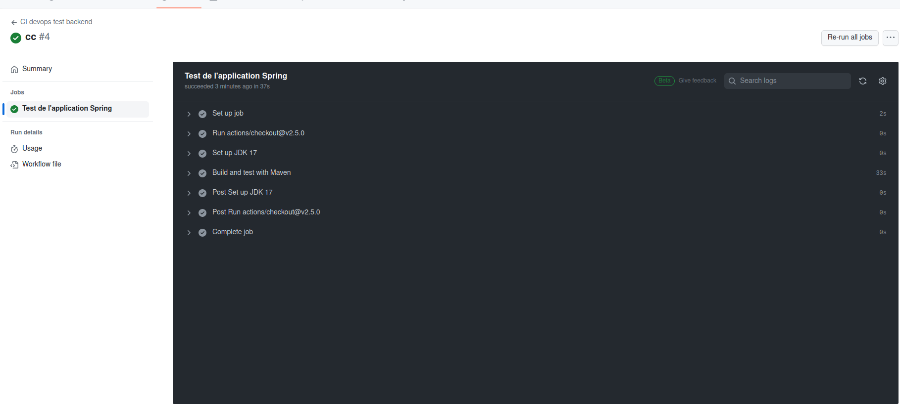

# TP2 Github actions

mvn clean verify : ne marche pas (java 11 sur pc de cpe qui doit être incompatible ... j'ai le message "annot find symbol")

2-1 What are testcontainers?

`Les testcontainers sont des bibliothèques qui permettent de créer et de gérer des conteneurs Docker pour les besoins de tests automatisés. Ces conteneurs sont utilisés pour exécuter des tests d'intégration ou des tests unitaires qui nécessitent des environnements spécifiques, tels que des bases de données ou des services tiers.`

J'ai placé mes TPs à la racine de mon repo pour que le worflow fonctionne avec git (j'avais fait un dossiser par TP avant cela)

Après avoir corrigé plusieurs choses suite à des bug (re-récupération des sources de api-student ...) mon workflow a bien marché :

J'ai ensuite créé mes variables d'environnement login et mdp

J'ai rempli mon workflow pipeline.yml et il s'éxécute bien aussi :

Tout s'est bien push sur mon docker également :

Après avoir créé mon compte Sonar, ma variable d'environnement SONAR_TOKEN dans Github action et complété mon workflow, la partie Sonar du workflow se fait bien :

Je n'ai pas un coverage à 100% mais l'analyse se fait bien !

Les pipelines sont bien séparées !